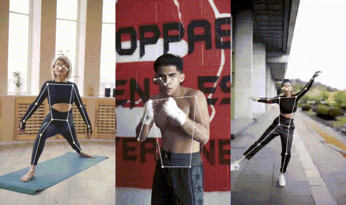
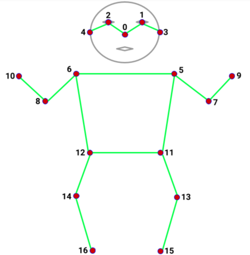

# MoveNet



# 简介

MoveNet 是属于 `Pose-Detection` 三种姿态识别模型之一。

具备极速和极为准确的特性，识别人体结构17个关键点。

TF.Hub上，提供了两种模型类型，`Lightning` 和 `Thunder`

> Lightning：用于延迟敏感的应用，具有极速特性
>
> Thunder：用于精确敏感的应用，具有精确特性

该两种模型，经实践，运动帧率：

- 在台式和笔记本上，>30FPS。

- 在手机上，>20FPS。

这对于在线健身，和保健应用至关重要

> 更多介绍，请见 [谷歌研究院推出MoveNet动作检测工具和TensorFlow.js API](https://baijiahao.baidu.com/s?id=1700070947952616201&wfr=spider&for=pc)


# 基本使用

在项目中获取此模型主要有两种方法：

- script标签 引入js

- npm模块 导入import


## script引入

```HTML
<script src="https://cdn.jsdelivr.net/npm/@tensorflow/tfjs-core"></script>
<script src="https://cdn.jsdelivr.net/npm/@tensorflow/tfjs-converter"></script>
<script src="https://cdn.jsdelivr.net/npm/@tensorflow/tfjs-backend-webgl"></script>
<script src="https://cdn.jsdelivr.net/npm/@tensorflow-models/pose-detection"></script>
```


## npm导入

```Bash
yarn add @tensorflow-models/pose-detection
yarn add @tensorflow/tfjs-core, @tensorflow/tfjs-converter
yarn add @tensorflow/tfjs-backend-webgl
yarn add @mediapipe/pose
```


## 模型使用

main.js

```JavaScript
import * as poseDetection from '@tensorflow-models/pose-detection';
import * as tf from '@tensorflow/tfjs-core';
import '@tensorflow/tfjs-backend-webgl';
```


## API

### detector

创建一个detector。

TF.Hub上，提供了两种模型类型，`Lightning` 和 `Thunder`

```JavaScript
const detectorConfig = {
    modelType: poseDetection.movenet.modelType.SINGLEPOSE_LIGHTNING,
    enableTracking: true,
    trackerType: poseDetection.TrackerType.BoundingBox
};

const detector = await poseDetection.createDetector(
    poseDetection.SupportedModels.MoveNet, detectorConfig
);
```

detectorConfig 的参数有：

- *modelType*（选填）：模型类型
  - `SINGLEPOSE_LIGHTNING` 默认，最低延迟的单人模型。
  - `SINGLEPOSE_THUNDER` 更精确，但延迟略高。
  - `MULTIPOSE_LIGHTNING` 多人识别，最多支持6个。
  - 

- *enableSmoothing*（选填）：默认为`True`，是否使用平滑预测点

- *modelUrl*（选填）：默认外网，detector模型地址

- *minPoseScore*（选填）：默认`0`，模型置信度限制，范围[0,1]

- *multiPoseMaxDimension*（选填）：默认`256`，多人目标尺寸限制。
  - 必须是32的整倍数
  - 推荐范围 [128, 512]
  - 尺寸越大，精度越高，速度越慢
  - 

- *enableTracking* （选填）：默认`True`，是否需要跨帧跟踪
  - 若为True，则每个姿势，都会有唯一的标识ID
  - 仅用于多姿态识别，`MULTIPOSE_LIGHTNING` 
  - 

- *trackerType*（选填）：默认`BoundingBox`，跟踪器类型

- *trackerConfig* （选填）：默认使用默认配置，跟踪器配置


### estimatePoses

```JavaScript
const poses = await detector.estimatePoses(image);
```

Image可支持的类型：

- `tf.Tensor3D`

- `ImageData`

- `HTMLImageElement`

- `HTMLCanvasElement `

- `HTMLVideoElement`


## 输出结构

```JSON
[
  {
    score: 0.8,
    keypoints: [
      {x: 230, y: 220, score: 0.9, score: 0.99, name: "nose"},
      {x: 212, y: 190, score: 0.8, score: 0.91, name: "left_eye"},
      ...
    ],
    keypoints3D: [
      {x: 0.65, y: 0.11, z: 0.05, score: 0.99, name: "nose"},
      ...
    ],
    segmentation: {
      maskValueToLabel: (maskValue: number) => { return 'person' },
      mask: {
        toCanvasImageSource(): ...
        toImageData(): ...
        toTensor(): ...
        getUnderlyingType(): ...
      }
    }
  }
]
```




0: nose  1: left_eye  2: right_eye  3: left_ear  4: right_ear  5: left_shoulder  6: right_shoulder  7: left_elbow 

8: right_elbow  9: left_wrist 10: right_wrist 11: left_hip 12: right_hip 13: left_knee 14: right_knee 

15: left_ankle 16: right_ankle


# 性能

> SinglePose Lightning | SinglePose Thunder | Multipose Lightning

|                                | MacBook Pro 15" 2019 Intel core i9. AMD Radeon Pro Vega 20 Graphics. (FPS) | iPhone 12 (FPS) | Pixel 5 (FPS) | Desktop Intel i9-10900K. Nvidia GTX 1070 GPU. (FPS) |
| ------------------------------ | ------------------------------------------------------------ | --------------- | ------------- | --------------------------------------------------- |
| *WebGL*                        | 104 \| 77 \| 54                                              | 51 \| 43 \| 24  | 34 \| 12 \| 8 | 34 \| 12 \| 8                                       |
| *WASM* with SIMD + Multithread | 42 \| 21 \| N/A                                              | N/A             | N/A           | 71 \| 30 \| N/A                                     |

若要在设备上查看模型的FPS，请尝试Google的[演示](https://storage.googleapis.com/tfjs-models/demos/pose-detection/index.html?model=movenet)。您可以在演示 UI 中实时切换模型类型和后端，以查看最适合您的设备的方法。